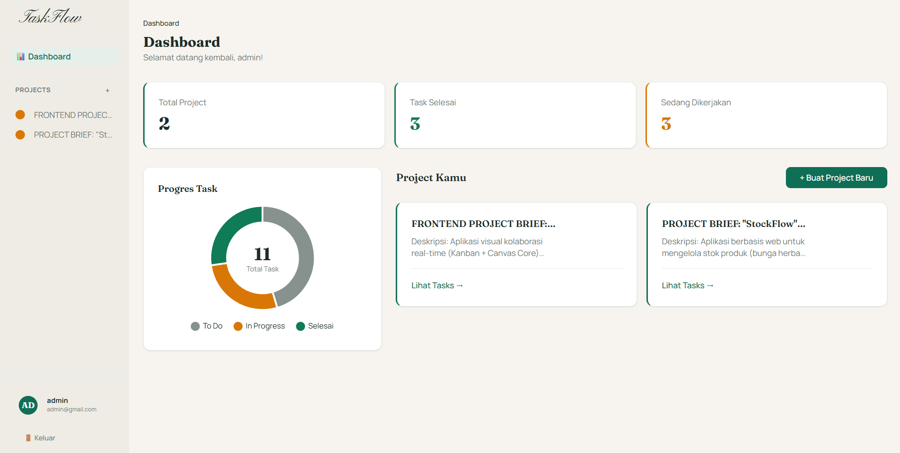
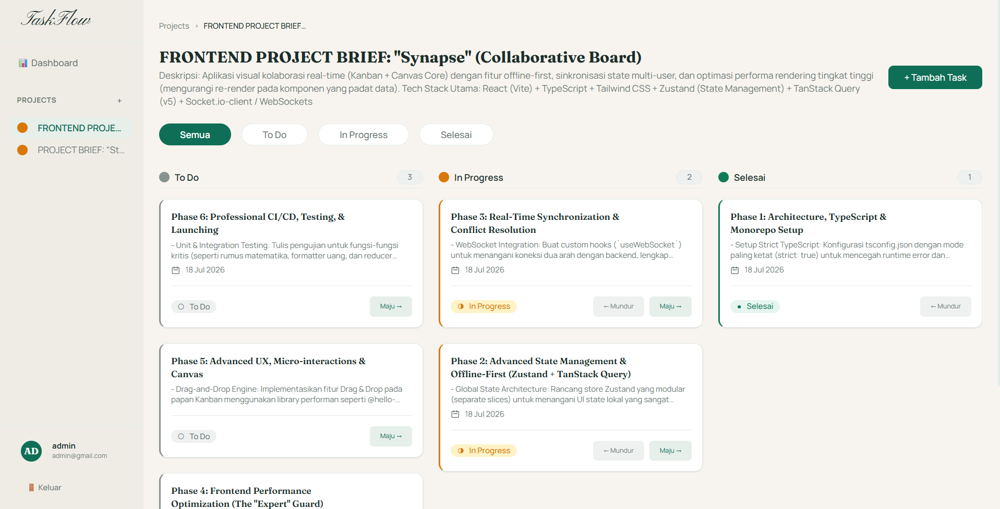
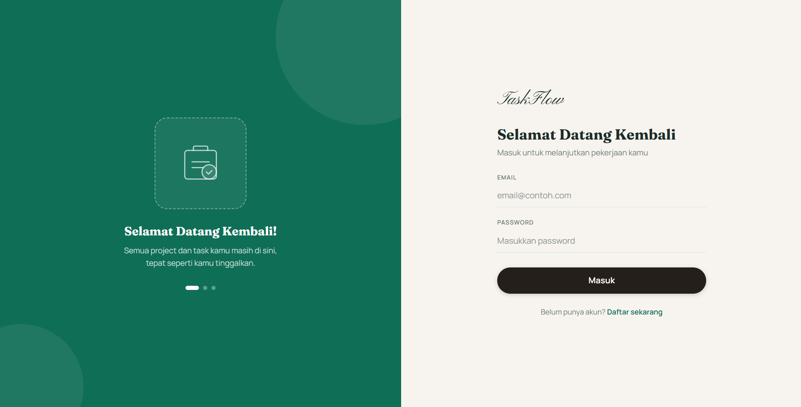

# TaskFlow

Aplikasi manajemen proyek & task sederhana (mirip Trello/Jira minimalis) — dibangun sebagai portofolio Fullstack Developer, dengan backend REST API dari nol, autentikasi JWT, dan integrasi frontend-backend yang sepenuhnya nyata (bukan data dummy).

**🔗 Live Demo:** [taskflow-frontend-atha.vercel.app](https://taskflow-frontend-atha.vercel.app)

> Akun demo bisa didaftarkan sendiri lewat halaman Register — tidak ada data pengguna lain yang perlu dijaga privasinya, jadi aman untuk dicoba bebas.

---

## 📸 Screenshot







## ✨ Fitur

- Autentikasi user (register & login) dengan JWT, password di-hash dengan bcrypt
- CRUD Project — buat, lihat, edit, hapus (cascade delete ke semua task di dalamnya)
- CRUD Task dalam tiap project — judul, deskripsi, status, deadline
- Kanban board 3 kolom (To Do / In Progress / Selesai), filter berdasarkan status
- Dashboard dengan ringkasan chart (doughnut) progres task + statistik project
- Setiap user hanya bisa mengakses data miliknya sendiri
- UI dengan sistem desain konsisten, animasi GSAP, dan layout responsif (sidebar off-canvas di mobile)

## 🛠️ Tech Stack

| Layer | Teknologi |
|---|---|
| Backend | Node.js, Express.js |
| Database | MySQL (TiDB Cloud — MySQL-compatible, serverless) |
| ORM | Sequelize |
| Autentikasi | JWT (jsonwebtoken), bcrypt |
| Frontend | React (Vite), Tailwind CSS v4 |
| HTTP Client | Axios |
| Chart | react-chartjs-2 |
| Animasi | GSAP |
| Deployment | Vercel (frontend & backend, backend sebagai serverless function) |

## 🏗️ Arsitektur Deployment

```
┌─────────────────┐      HTTPS       ┌──────────────────┐      SSL      ┌──────────────┐
│  Frontend        │ ───────────────▶│  Backend           │─────────────▶│  TiDB Cloud   │
│  (Vercel, React) │◀─────────────── │  (Vercel Serverless)│◀───────────── │  (MySQL)      │
└─────────────────┘     JSON/REST    └──────────────────┘   Sequelize   └──────────────┘
```

Backend dijalankan sebagai Vercel Serverless Function (bukan server yang selalu menyala), terhubung ke database MySQL-compatible di TiDB Cloud melalui koneksi SSL.

## 🚀 Menjalankan di Lokal

### Prasyarat
- Node.js 18+
- MySQL lokal (bisa pakai Laragon/XAMPP) **atau** langsung pakai kredensial TiDB Cloud

### 1. Clone repo

```bash
git clone https://github.com/USERNAME/taskflow.git
cd taskflow
```

### 2. Setup Backend

```bash
cd backend
npm install
cp .env.example .env
```

Isi `.env` sesuai environment kamu:

```
DB_HOST=localhost
DB_PORT=3306
DB_USER=root
DB_PASS=
DB_NAME=taskflow_db
DB_SSL=false
JWT_SECRET=isi_dengan_string_acak
PORT=5000
FRONTEND_URL=http://localhost:5173
```

Buat database (kalau pakai MySQL lokal):

```sql
CREATE DATABASE taskflow_db;
```

Jalankan server:

```bash
npm start
```

Backend berjalan di `http://localhost:5000`.

### 3. Setup Frontend

Buka terminal baru:

```bash
cd frontend
npm install
cp .env.example .env
```

Isi `.env`:

```
VITE_API_URL=http://localhost:5000/api
```

Jalankan dev server:

```bash
npm run dev
```

Frontend berjalan di `http://localhost:5173`.

## 📡 Daftar Endpoint API

### Auth
| Method | Endpoint | Keterangan |
|---|---|---|
| POST | `/api/auth/register` | Daftar user baru |
| POST | `/api/auth/login` | Login, mengembalikan JWT |

### Projects *(butuh token)*
| Method | Endpoint | Keterangan |
|---|---|---|
| GET | `/api/projects` | List semua project milik user |
| POST | `/api/projects` | Buat project baru |
| GET | `/api/projects/:id` | Detail satu project |
| PUT | `/api/projects/:id` | Update project |
| DELETE | `/api/projects/:id` | Hapus project (cascade ke task) |

### Tasks *(butuh token)*
| Method | Endpoint | Keterangan |
|---|---|---|
| GET | `/api/projects/:projectId/tasks` | List task dalam project (`?status=` untuk filter) |
| POST | `/api/projects/:projectId/tasks` | Buat task baru |
| PUT | `/api/tasks/:id` | Update task (termasuk ubah status) |
| DELETE | `/api/tasks/:id` | Hapus task |

### Dashboard *(butuh token)*
| Method | Endpoint | Keterangan |
|---|---|---|
| GET | `/api/dashboard/summary` | Ringkasan jumlah task per status & total project |

## 📁 Struktur Folder

```
taskflow/
├── backend/
│   ├── api/                # Entry point serverless (Vercel)
│   ├── src/
│   │   ├── config/         # Koneksi database
│   │   ├── controllers/    # Logic tiap endpoint
│   │   ├── middleware/     # Auth JWT, error handler
│   │   ├── models/         # Model Sequelize (User, Project, Task)
│   │   ├── routes/         # Definisi route
│   │   └── app.js
│   ├── server.js           # Entry point untuk development lokal
│   └── vercel.json
└── frontend/
    ├── src/
    │   ├── api/             # Axios instance
    │   ├── components/      # Komponen shared, layout, project, task
    │   ├── context/         # AuthContext
    │   ├── hooks/           # useProjects, useTasks
    │   ├── pages/           # AuthPage, DashboardPage, ProjectDetailPage
    │   └── utils/           # GSAP animation helpers
    └── vercel.json
```

## 🧩 Tantangan Selama Development & Deployment

Beberapa masalah nyata yang ditemukan dan diselesaikan selama proses (dicatat karena relevan untuk didiskusikan saat interview):

- **CSS cascade layer (Tailwind v4):** reset CSS (`* { margin: 0; padding: 0 }`) yang tidak dibungkus `@layer base` ternyata menimpa seluruh utility class spacing, menyebabkan layout tidak center dan elemen saling bertabrakan.
- **Sequelize + dynamic require di lingkungan serverless:** Vercel gagal mem-bundle `mysql2` karena Sequelize memanggilnya lewat `require()` dinamis berbasis string, sehingga bundler tidak mendeteksinya sebagai dependency. Diselesaikan dengan menambahkan static import eksplisit.
- **CORS di lingkungan multi-domain:** origin frontend dan backend berada di domain Vercel yang berbeda, sehingga `FRONTEND_URL` di environment variable backend harus disertakan lengkap dengan scheme (`https://`), bukan hanya domain.
- **IP allowlist database cloud:** TiDB Cloud secara default membatasi akses berdasarkan IP, sementara backend serverless tidak memiliki IP statis — diselesaikan dengan mengizinkan akses publik dan tetap mengandalkan autentikasi user/password database.
- **SPA routing pada static hosting:** refresh halaman di route selain `/` (misalnya `/register`) menghasilkan 404 di Vercel karena file fisik untuk path tersebut tidak ada — diselesaikan dengan rewrite rule di `vercel.json` agar semua path di-fallback ke `index.html`.

## 👤 Author

Athallah Muhammad Syaffa

## 📄 Lisensi

Project ini dibuat untuk keperluan portofolio.
